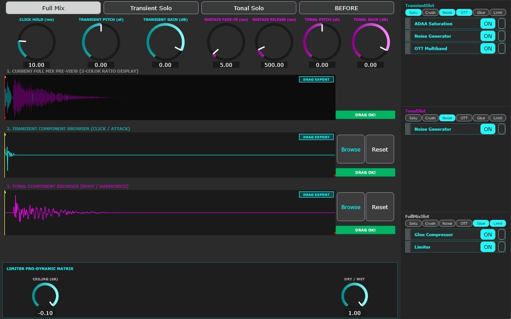

# ANATOMY


---

## ⚠️ **IMPORTANT: Audio Safety Notice**

> **This plugin can generate LOUD audio output. HEARING PROTECTION IS YOUR RESPONSIBILITY.**
>
> * Always monitor output levels carefully when using speakers or headphones
> * Start with LOW volume and gradually increase
> * **NEVER wear headphones at maximum volume**
> * Take regular breaks during extended use
> * Prolonged exposure to loud sound (≥85 dB SPL) causes permanent hearing loss
> * By using this plugin, you assume FULL responsibility for your hearing safety and equipment protection
>
> **For detailed safety information, see the [Disclaimer](#%EF%B8%8F-disclaimer) section.**

---

##


## Overview

**ANATOMY** is a high-performance, open-source VST3 plugin that performs **real-time Transient/Tonal audio separation**, routing each component through its own independent multi-effect chain. ANATOMY gives you surgical control over the *anatomy* of your sound — transient click, tonal sustain, and the full mix — each with a dedicated suite of 6 professional-grade effects.

> ⚠️ **ANATOMY is a sound design tool — not a real-time mix insert.**
> The intended workflow is: **shape your sound → export as WAV via EXPORT → load into a high-quality sampler** (Ableton Simpler / Sampler, Native Instruments Kontakt, etc.) for playback. It is not designed for continuous real-time processing on a live mix bus.

Process each layer with **ADAA Saturation**, **BitCrusher**, **Noise Generator**, **OTT Multiband Compression**, **Glue Compressor**, and **Limiter** independently, then **export finished stems as WAV** and load them into your sampler of choice. ANATOMY is engineered for extreme real-time safety and Ableton Live stability.

## 🎬 Demo Videos

<p align="center">
  <b>Introduction (概要編)</b><br>
  <a href="https://youtu.be/PLACEHOLDER_1">
    
  </a>
</p>

## Key Features

### 🔬 Real-Time Transient / Tonal Separation

ANATOMY splits any incoming audio into three independently processable signal paths:

* **TRANSIENT lane:** The percussive attack/click component of your signal — transient punch, snap, and impact.
* **TONAL lane:** The sustained, harmonic, and pitched content — body, tone, and decay.
* **FULL MIX lane:** The unprocessed combined signal, available for parallel processing or final shaping.

Each lane features independent **Pitch**, **Gain**, and **shape controls**, giving you precise sculpting power over separation behaviour before effects are even applied.

### 🎛️ 6-Effect Chain per Lane (18 Total)

Every lane has access to the same 6 professional-grade DSP modules. Effects are **inserted in any order** via drag-and-drop within the Effect Rack, and their parameters are adjusted in real time via the Parameter Dock:

| # | Effect | Category | Description |
|---|---|---|---|
| 1 | **ADAA Saturation** | Distortion | Anti-Derivative Anti-Aliased soft saturation with Drive, Asymmetry, Output Trim, and Pre-HPF |
| 2 | **BitCrusher** | Lo-Fi | Bit-depth reduction and sample-rate decimation with Jitter for vintage digital character |
| 3 | **Noise Generator** | Texture | Transient noise burst (WHITE / PINK / BROWN / BLUE) with Attack, Decay, Gain, and Band-Pass frequency |
| 4 | **OTT Multiband** | Dynamics | 3-band upward/downward compressor with per-band Up/Down/Gain, crossover tuning, Time, Gate Floor, and Depth |
| 5 | **Glue Compressor** | Dynamics | Bus-style compressor with Threshold, Ratio, Attack, Release, Makeup Gain, and Depth |
| 6 | **Limiter** | Dynamics | Transparent brick-wall limiter with adjustable Ceiling and Dry/Wet |

### 🔀 Drag-and-Drop Effect Ordering

The Effect Rack displays active effects as a **vertically ordered chip list** showing the exact processing chain. Simply drag chips up or down to rearrange the processing order in real time — no menus, no guessing. Right-click any chip for **Remove**, **Move Up**, or **Move Down** options.

### 📤 One-Click Stem Export → Sampler Ready

Each lane has a dedicated **EXPORT** button. Press once to record the next playback, then **drag the rendered WAV into a sampler** (Ableton Simpler / Sampler, Kontakt, etc.) for instant playback and further use. This export-to-sampler workflow is the core intended use of ANATOMY. Zero plugin freezing, zero rendering dialogs.

### 🎨 Real-Time Waveform Visualization

Three high-resolution waveform displays (FULL MIX / TRANSIENT / TONAL) update in real time as audio plays. A **BEFORE** button allows instant A/B comparison against the unprocessed signal.

---

## 🖥️ Signal Flow

```
Stereo Input (L/R)
    │
    ├─► [Transient/Tonal Splitter]
    │   ├── TRANSIENT: Click curve, Pitch, Gain
    │   └── TONAL:     Sustain curve, Pitch, Gain, Release
    │
    ├─► [TRANSIENT Effect Chain]         ← Up to 6 effects, user-defined order
    │   ├── ADAA Saturation (optional)
    │   ├── BitCrusher      (optional)
    │   ├── Noise Generator (optional)
    │   ├── OTT Multiband   (optional)
    │   ├── Glue Compressor (optional)
    │   └── Limiter         (optional)
    │
    ├─► [TONAL Effect Chain]             ← Identical structure, independent chain
    │
    ├─► [FULL MIX Effect Chain]          ← Runs on original unsplit signal
    │
    ├─► [Stem Export Recorder]           ← Per-lane WAV capture (lock-free)
    │
    └─► Stereo Output (L/R)
        └── Waveform Visualizers (3×)
```

---

## Parameter Reference

### Lane Controls (Transient / Tonal)

| Parameter | Range | Description |
|---|---|---|
| Click Length | 0.0 – 1.0 | Duration of the transient extraction window |
| Click Curve | 0.0 – 1.0 | Envelope shape of the transient (sharp → smooth) |
| Pitch | -24 – +24 semitones | Pitch shift applied to the lane output |
| Gain | -24 – +24 dB | Output gain of the lane |
| Sustain Release | 0.0 – 1.0 | Tonal decay tail length |

### Effect Parameters

#### 🟣 ADAA Saturation

| Parameter | Range | Default | Description |
|---|---|---|---|
| DRIVE | 1.0 – 16.0 | 2.0 | Saturation drive amount |
| ASYMMETRY | 0.0 – 1.0 | 0.0 | Waveform asymmetry (even harmonic content) |
| OUT TRIM | -12 – +12 dB | 0 dB | Output level trim post-saturation |
| PRE HPF | 20 – 2000 Hz | 20 Hz | High-pass filter before saturation (DC/low-end protection) |
| DRY/WET | 0.0 – 1.0 | 1.0 | Parallel dry/wet blend |

#### 🟣 BitCrusher

| Parameter | Range | Default | Description |
|---|---|---|---|
| BITS | 2 – 24 bit | 8 | Bit depth reduction |
| DOWNSAMPLE | 1 – 32× | 4 | Sample rate decimation factor |
| JITTER | 0.0 – 1.0 | 0.0 | Sample-timing jitter amount (vintage instability) |
| DRY/WET | 0.0 – 1.0 | 1.0 | Parallel dry/wet blend |

#### 🟣 Noise Generator

| Parameter | Range | Default | Description |
|---|---|---|---|
| DECAY ms | 1 – 1000 ms | 100 ms | Noise burst decay time |
| GAIN dB | -60 – 0 dB | 0 dB | Noise output level |
| ATTACK ms | 0 – 50 ms | 0 ms | Noise burst attack time |
| BP FREQ | 0 – 4000 Hz | 0 Hz | Band-pass filter center frequency (0 = bypass) |
| TYPE | WHITE / PINK / BROWN / BLUE | WHITE | Noise spectral colour |
| DRY/WET | 0.0 – 1.0 | 1.0 | Parallel dry/wet blend |

#### 🟣 OTT Multiband

**Main Parameters:**

| Parameter | Range | Default | Description |
|---|---|---|---|
| TIME | 0.1 – 10.0 | 1.0 | Attack/release time constant |
| LO/MI XO | 40 – 1000 Hz | 200 Hz | Low/Mid band crossover frequency |
| MI/HI XO | 1000 – 15000 Hz | 2500 Hz | Mid/High band crossover frequency |
| GATE dB | -70 – -20 dB | -45 dB | Noise gate floor |
| DEPTH | 0.0 – 1.0 | 1.0 | Overall compression depth (Dry/Wet) |

**Per-Band Parameters (LOW / MID / HIGH):**

| Parameter | Range | Default | Description |
|---|---|---|---|
| UP | 0.0 – 1.0 | 1.0 | Upward compression amount |
| DOWN | 0.0 – 1.0 | 1.0 | Downward compression amount |
| GAIN dB | -24 – +24 dB | 0 dB | Per-band output gain trim |

#### 🟣 Glue Compressor

| Parameter | Range | Default | Description |
|---|---|---|---|
| THR dBFS | -40 – 0 dB | -18 dB | Compression threshold |
| RATIO | 1.0 – 20.0 | 2.0 | Compression ratio |
| ATK ms | 1 – 100 ms | 30 ms | Attack time |
| REL ms | 10 – 1000 ms | 200 ms | Release time |
| MAKEUP dB | -12 – +12 dB | 0 dB | Makeup gain post-compression |
| DEPTH | 0.0 – 1.0 | 1.0 | Parallel blend (Dry/Wet) |

#### 🟣 Limiter

| Parameter | Range | Default | Description |
|---|---|---|---|
| CEILING dB | -24 – 0 dB | -0.1 dB | Brick-wall output ceiling |
| DRY/WET | 0.0 – 1.0 | 1.0 | Parallel dry/wet blend |

---

## 📚 User Guide

Comprehensive user manuals covering every control, effect parameter, stem export workflow, and advanced techniques are included in this repository.

[ -blue?style=for-the-badge&logo=markdown) ](Source/Assets/ANATOMY_UserManual_JP.md)
[ -blue?style=for-the-badge&logo=markdown) ](Source/Assets/ANATOMY_UserManual_EN.md)


---

## Installation

### VST3 Plugin Installation

1. Download the latest `ANATOMY.vst3` from the [Releases](https://github.com/OTODESK4193/ANATOMY/releases/latest) page.
2. Copy the `.vst3` folder to your VST3 plugin directory:
   ```
   C:\Program Files\Common Files\VST3\
   ```
3. Rescan plugins in Ableton Live (or your DAW of choice).

---

## System Requirements

* **OS:** Windows 10 / Windows 11 (64-bit)
* **Format:** VST3 
* **CPU:** AVX2 support required (Intel Haswell 2013+ / AMD Ryzen 2017+)
* **RAM:** 256 MB minimum
* **Disk:** 50 MB

> ⚠️ **Compatibility Notice:** Compiled and optimized exclusively for Windows 64-bit with AVX2. Verified operation confirmed in **Ableton Live 11 / 12**. Other DAWs (FL Studio, Bitwig, Studio One, Cubase, Reaper) may work but are currently unverified.

---

## Technical Architecture


### DSP Modules

| Module | Purpose |
|---|---|
| **Transient/Tonal Splitter** | Real-time signal decomposition into percussive and tonal components |
| **ADAA_Saturation** | Anti-Derivative Anti-Aliased waveshaper (2nd order ADAA) |
| **BitCrusher** | Integer quantization + sample-rate decimation with jitter |
| **NoiseGenerator** | Triggered noise burst (WHITE/PINK/BROWN/BLUE) with envelope and band-pass |
| **OTT_Multiband** | 3-band upward + downward compression (TPT crossover, ZDF per-band dynamics) |
| **GlueCompressor** | Feed-forward RMS bus compressor with soft-knee |
| **Limiter** | Peak-hold brick-wall limiter with adjustable ceiling |
| **EffectChain** | Lock-free ordered chain dispatcher with per-lane snapshot management |
| **WaveformComponent** | Real-time rasterized waveform renderer (VBlank-synchronized) |
| **ExportRecorder** | Lock-free per-lane WAV capture with DAW drag-and-drop delivery |

---

## ⚠️ Disclaimer

### Software Warranty

This software is provided "as-is", without any warranty of any kind. While extreme care has been taken to ensure real-time safety, audio stability, and Ableton Live compatibility through rigorous testing and professional DSP practices, unexpected behavior may still occur in edge cases or unsupported hosts. Use at your own risk in mission-critical production environments.

### 🔊 Audio Output & Hearing Protection — Critical Notice

**This plugin can generate loud audio output. User bears sole responsibility for safe audio monitoring.**

* **HEARING DAMAGE RISK:** Prolonged exposure to loud sound (≥85 dB SPL) can cause permanent hearing loss. This risk applies regardless of equipment type or volume settings.
* **SPEAKER / HEADPHONE USE:** Always monitor output levels carefully. Start with low volume and gradually increase. Never wear headphones at maximum volume. Take regular breaks during extended use.
* **SELF RESPONSIBILITY:** The user assumes complete and exclusive responsibility for:
  - Setting appropriate monitoring levels
  - Protecting their own hearing and that of others
  - Equipment safety and damage risk
  - All consequences of audio output usage
* **NO LIABILITY:** The developer(s) and distributor(s) of this software assume no liability for:
  - Hearing loss, tinnitus, or any physical harm
  - Equipment damage due to audio output
  - Any injury or damage caused by improper use
* **USE AT YOUR OWN RISK:** By using this plugin, you acknowledge and accept all audio-related risks inherent to audio production software.

---

**Your hearing is irreplaceable. Prioritize hearing protection at all times.** 🎧

---


## License

This project is licensed under the GNU Affero General Public License v3.0 (AGPLv3) - see the [LICENSE](LICENSE) file for details.
This software is built using the **JUCE 8** framework. In accordance with JUCE 8's open-source licensing terms, this entire project is distributed under the AGPLv3.


## Credits

**Developer:** @OTODESK

**Music Production Background:** Electronic Music, Sound Design, DSP Engineering, JUCE plugin development

**Target DAW:** Ableton Live 11 / 12

**Framework:** JUCE 8.0.x

---

## Support

* **Social / Demo:** [@OTODESK](https://x.com/kijyoumusic)
* [](https://otodesk4193.github.io/OTODESK_SITE/)

---

**Dissect your sound. 🔬**
